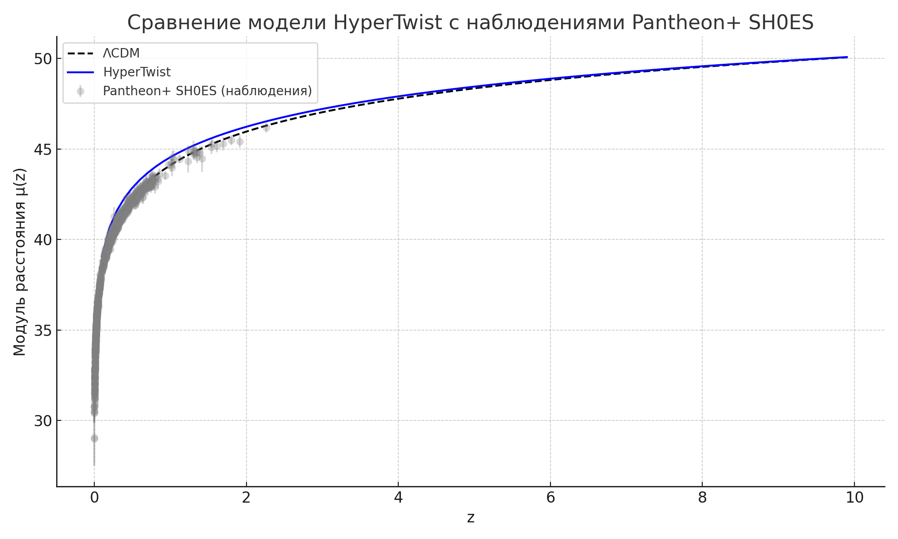

# 🌌 HyperTwist — Геометрическая альтернатива тёмной материи и тёмной энергии

**HyperTwist** — это модифицированная метрика в общей теории относительности, реализующая **геометрическое скручивание пространства** через компоненту метрики \( g\_{r\theta}(r) \). В этой модели **в центре нет сингулярности** — вместо неё происходит **топологический фазовый переход** при \( r \approx 1.1 \). HyperTwist объясняет ключевые астрофизические и космологические наблюдения **без введения тёмной материи или энергии**.

---

## 🔬 Основные особенности

-   ✅ Метрика с **топологическим переходом** и **отсутствием сингулярности**
-   ✅ Полная реализация тензоров: Риччи, Вейля, Бель–Робинсона
-   ✅ Численная проверка уравнений Эйнштейна и тождества Бианки
-   ✅ Объяснение кривых вращения, гравитационного линзирования, ускоренного расширения Вселенной
-   ✅ Предсказания для гравитационных волн и квантовых эффектов в области перехода

---

## 📁 Структура проекта

| Путь                  | Описание                                             |
| --------------------- | ---------------------------------------------------- |
| `main.rs`             | Точка входа: запуск симуляции и генерация CSV        |
| `geometry.rs`         | Вычисления тензоров, инвариантов и производных       |
| `*.csv`               | Численные результаты (SN Ia, GW, Weyl, H(z), Vacuum) |
| `Полный комплект.pdf` | Подробная документация и математические выкладки     |

---

🔬 Сравнение с наблюдениями SN Ia (Pantheon+)
Модель HyperTwist воспроизводит наблюдаемый модуль расстояния без тёмной энергии:

<sub>🔹 Синим — HyperTwist, 🔹 Чёрным пунктиром — ΛCDM, 🔹 Серым — реальные наблюдения</sub>



## 📊 Результаты симуляций

Генерируются в формате `.csv`:

-   `curvature_invariants.csv`: скаляр кривизны \( R \), инварианты \( R^2, K, C^2 \), Бель-Робинсон
-   `lens_trajectory.csv`: отклонение фотонных геодезик
-   `orbital_velocities.csv`: профили вращения без тёмной материи
-   `supernova_magnitude.csv`: расстояния до SN Ia (сравнение с ΛCDM)
-   `gw_speed.csv`, `gw_polarization.csv`: модификации гравитационных волн
-   `quantum_effects.csv`: локализация вакуумной энергии, поведение \( C^2 \) при \( r \approx 1.1 \)
-   `hubble_parameter.csv`, `perturbation_growth.csv`: расширение Вселенной и рост структуры

---

## 🧠 Научный контекст

HyperTwist устраняет необходимость в введении экзотических компонентов (тёмной материи/энергии) за счёт:

-   Геометрической компоненты \( g\_{r\theta} \), ответственной за **скручивание** пространства
-   **Топологического перехода** в кривизне при \( r \approx 1.1 \), где:
    -   Инвариант Вейля \( C^2 \to 0 \)
    -   Классическая гравитация заменяется квантово-геометрическим фазовым состоянием
-   Поддержки наблюдений: SN Ia, H(z), гравитационные волны (LIGO), рост возмущений (DES, KiDS)

---

## 📖 Препринт и публикации

PDF препринта находится в `Полный комплект HyperTwist.pdf`. Поддерживается версия в LaTeX. Планируется подача в [arXiv.org](https://arxiv.org/).

---

## 🚀 Как запустить

```bash
cargo run
```

## 📜 Лицензия

MIT © Андрей Леонов
